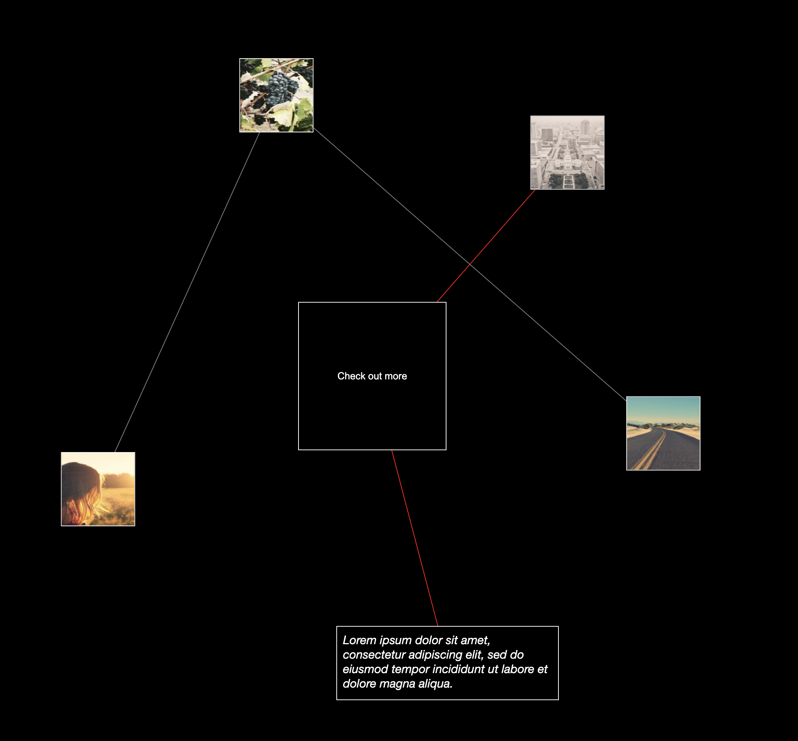

# Reactive force-directed graph

The aim of this 'experiment' is to display React components as nodes in a force-directed graph. It uses `d3` for it's data layer and outsources rendering to `react`, whilst handling any positional updates outside of the react render loop for performance.

At the heart of this is `foreignObject`, a tag part of the svg spec, that let's you render regular dom objects within the svg markup. This greatly simplifies transforms, as react nodes don't have to be overlayed on top of the svg graph.

